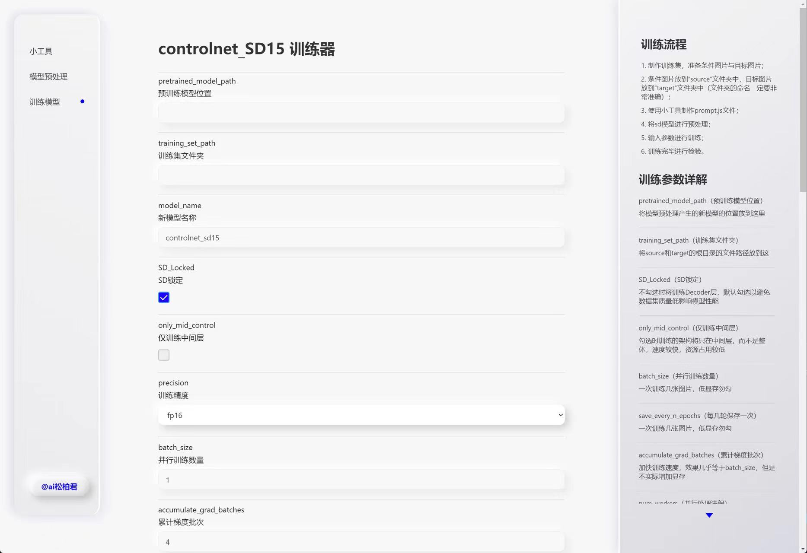
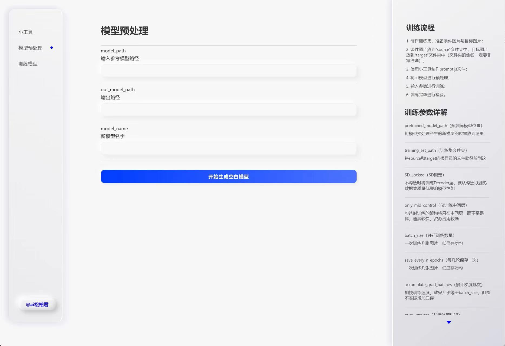
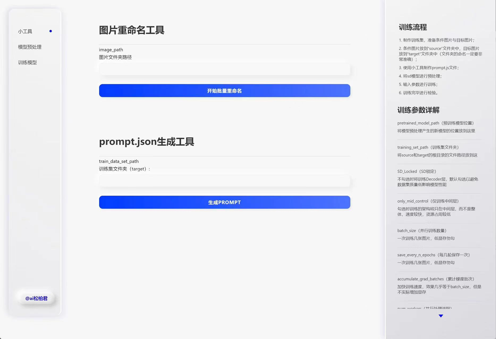

# controlnet_TrainingPackage（controlnet模型训练包）

## 介绍

🤖️ 一种利用pytorch lighting训练controlnet模型的工具包。

💡 现在没有很方便的让用户自己训练controlnet模型的工具包，所以这个工具包就是为了解决这个问题而生的。

📦 工具包包含：

* 训练脚本（可以直接用脚本训练）
* 训练包的UI界面（非常直观的填写参数）
* 训练数据
* 训练小工具（包括一键训练集命名、一键生成prompt.json等）

✅ 工具包特点：
* 方便实用，脚本或者UI界面都可以启动
* 目前仅支持训练SD1.5的controlnet模型

## 安装方法

需要有python版本：3.8。

1. 建立虚拟环境+安装依赖。
- 这一步可以手动创建，也可以双击“setup.bat”一键安装。
  - pytorch需要根据自己配置来安装。
- 安装完环境依赖后，就可以直接用脚本训练模型。
  - 项目根目录下所有带“_par”后缀的.py文件都是脚本。
  - 其中“controlnet_sd15_train_par.py”是训练脚本。
2. 使用UI界面，需要有npm。
- “setup.bat”可以一键安装所有依赖。安装完后可以用UI界面训练模型。
3. 下载模型（必须）
- 模型下载地址：https://huggingface.co/lllyasviel/ControlNet/tree/main/models
  - 需要下载“pytorch_model.bin”文件
- 下载完模型后，需要将模型放到根目录的“clip-vit-large-patch14”文件夹下。
4. 下载训练时的base模型（必须）
- 模型下载地址：https://huggingface.co/runwayml/stable-diffusion-v1-5/tree/main
  - 需要下载“v1-5-pruned.ckpt”文件
  - 下载完模型后，将模型任意妥善文件夹下

## UI界面

## 训练流程

1. 制作训练集，准备原始图片、条件图片与目标图片；
- controlnet模型需要准备原始图片，条件图片以及目标生成图片，这三样缺一不可。
- 原始图片是指从什么图片中提取特征，就是你放到webui的controlnet插件中的图片；
- 条件图片是指从原始图片中提取的特征图片，就是那种你在webui的controlnet插件中按下爆炸图标后生成的图片；
- 目标图片是指你用controlnet后希望生成的图片。
2. 条件图片放到“source”文件夹中，目标图片放到“target”文件夹中（文件夹的命名一定要非常准确）；
3. 使用小工具制作prompt.js文件；
4. 将sd模型进行预处理；
5. 输入参数进行训练；
6. 训练完毕进行检验。

---

## Introduction

🤖 A toolkit for training control net models using pytorch lighting.

💡 There is currently no convenient toolkit for users to train their own ControlNet models, so this toolkit was developed to address this issue.

📦 The toolkit includes:

* Training script (can be directly used for training)

* UI interface of training package (very intuitive for filling in parameters)

* Training data

* Training tools (including one click training set naming, one click generating prompt. json, etc.)

✅ Tool kit features:

* Convenient and practical, scripts or UI interfaces can be launched

* Currently, only training SD1.5's controllnet model is supported

##Installation method

Python version 3.8 is required.

1. Establish a virtual environment and install dependencies.

- This step can be manually created or double clicked on "setup. bat" for one click installation.
    - pytorch needs to be installed according to your own configuration

- After installing the environment dependencies, you can directly train the model using scripts.

- All. py files with the suffix "_par" in the root directory of the project are scripts.

- Among them, "controllet_sd15_train_par. py" is the training script.

2. To use the UI interface, NPM is required.

- "Setup. bat" can install all dependencies with just one click. After installation, the model can be trained using the UI interface.

3. Download model (mandatory)

- Model download address: https://huggingface.co/lllyasviel/ControlNet/tree/main/models

- Need to download the "pytorch_model. bin" file

- After downloading the model, you need to place it in the "clip vit target patch14" folder in the root directory.

4. Download the base model for training (mandatory)

- Model download address: https://huggingface.co/runwayml/stable-diffusion-v1-5/tree/main

- Need to download the "v1-5 pruned. ckpt" file

- After downloading the model, place it in any appropriate folder

##UI interface

! [Training Main Interface] (img/1.jpg)

! [Model Preprocessing Interface] (img/2.jpg)

! [Widget Interface] (img/3.jpg)

##Training process

1. Create a training set, prepare original images, conditional images, and target images;

- The controllnet model requires the preparation of raw images, conditional images, and target generated images, all of which are indispensable.

- The original image refers to the image from which features are extracted, which is the image you put in the Controlnet plugin of the webui;

- Conditional images refer to feature images extracted from the original image, which are the images generated by pressing the explosion icon in the Controlnet plugin of WebUI;

- The target image refers to the image you want to generate after using ControlNet.

2. Place the conditional image in the "source" folder and the target image in the "target" folder (the folder name must be very accurate);

3. Use small tools to create the prompt.js file;

4. Preprocess the SD model;

5. Input parameters for training;

6. Conduct testing after training is completed.
